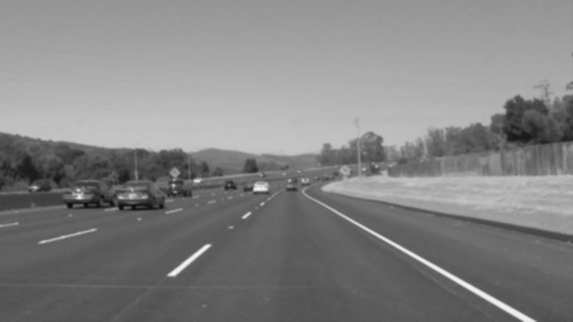
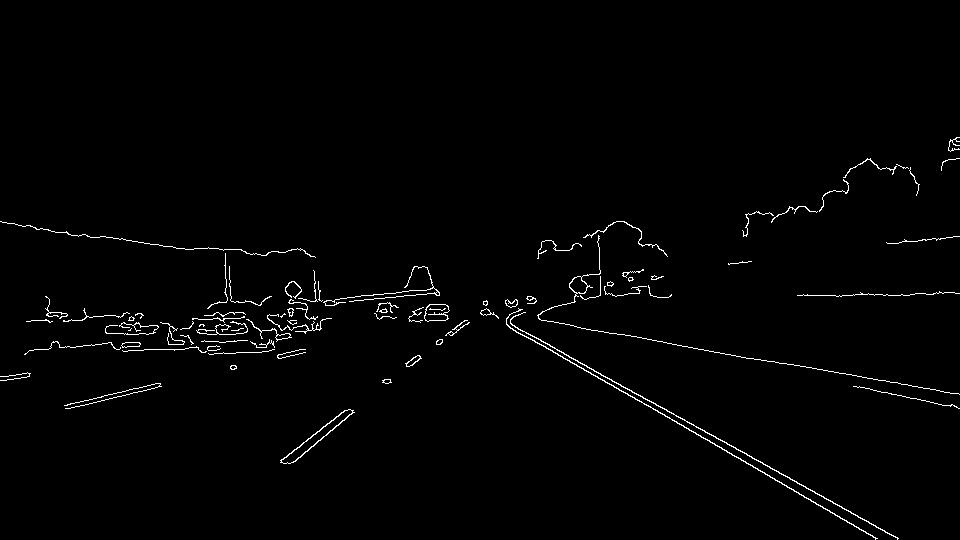
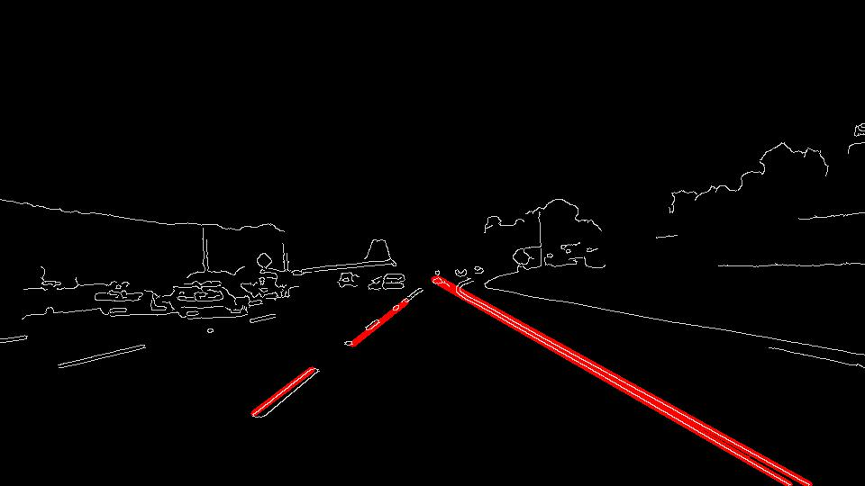

# **Finding Lane Lines on the Road** 

## Writeup Template

---

**Finding Lane Lines on the Road**

The goals / steps of this project are the following:
* Make a pipeline that finds lane lines on the road
* Reflect on your work in a written report

[//]: # (Image References)

---

### Reflection

### 1. Describe your pipeline. As part of the description, explain how you modified the draw_lines() function.

My pipeline consisted of 5 steps. First, I converted the images to grayscale. Next, using a Gassian filter I smooth out the image so when I use Canny edge ditection the noise of sections that are not edges gets reduced. the kernel size used for Gaussian blur is 5 and sigma is 1.6 both in X and Y direction. The reason I increased the sigma of Guassian blur was to reduce the noise so that I get a better result in the optional section of the assignment.  

After blurring the image I use Canny edge detection to find the edges in each frame. Then using Hough transform I draw specific line in mind in image using draw line function. In order to draw a single line on the left and right lanes, I modified the draw_lines() function by calculating slope of each line and bounding the slopes between 0.5 to 0.7 for positive slope and (-0.5) to (-0.7).I also changed the parameters of Hough function to make the lines solid. I increased the max_line_gap to 200.

In the end I overlay the image with lines drwn on it on the image with edges.

Fllowing images illustrate the process stp by step: 

[image1]: 
[image2]: 
[image3]: 
[image4]: 

### 2. Identify potential shortcomings with your current pipeline

The short comings happen when the lane lines of a section of the road is missing in that case the output misses the line of detected as well.

### 3. Suggest possible improvements to your pipeline

 iImprove the draw line so when there is no lane lines in the road it can draw lines.

